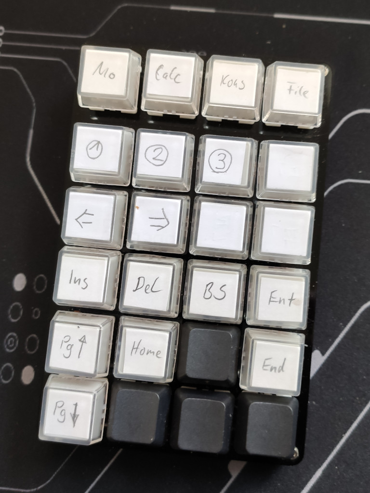
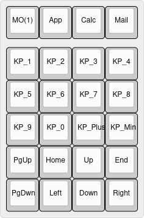

# YMDK NP21 Makropad

:warning: Deprecated! I do not use this macropad anymore :warning:

Cheap macropad from Aliexpress. For some reason the hardware of my pad differs from the YMDK NP32 in the QMK branch. It has a Atmel 32U4 and obviously a different pinning. Besides that nothing special there, I modify its mapping and use it mostly to launch apps, to control my linux workspaces and desktops

 - Keys: Gateron Red
 - Keycaps: Leftovers and transparent caps  

[Layout](http://www.keyboard-layout-editor.com/#/gists/047d124a94b16bdd7a472bd64c075454)
